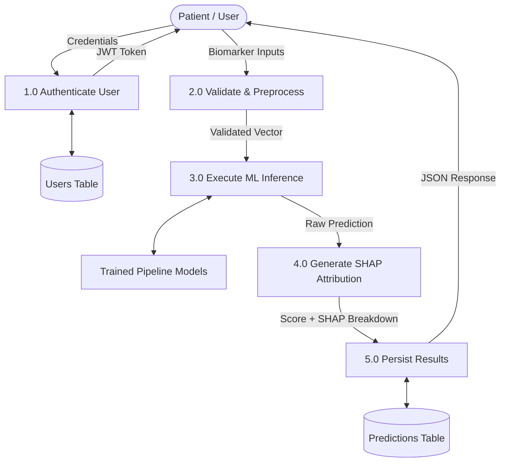
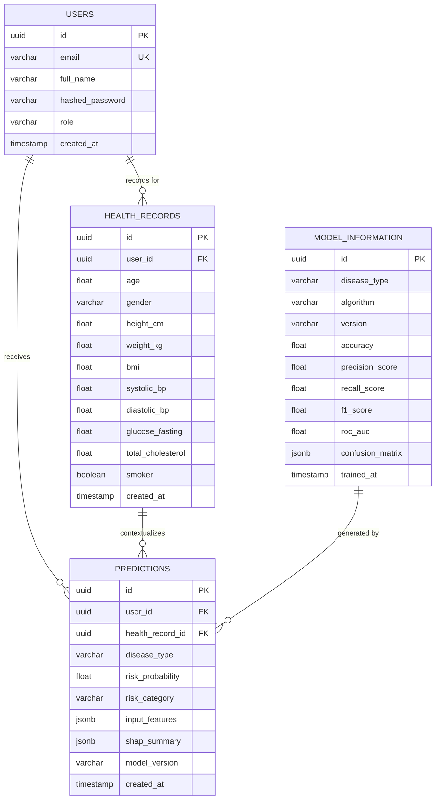
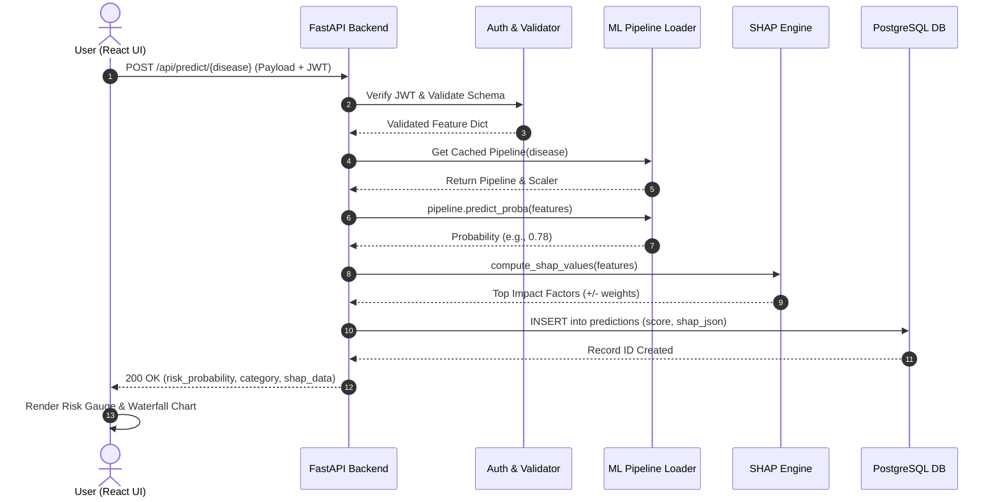

# College Project Documentation: Explainable Machine Learning-Based System for Early Disease Risk Prediction

**Academic Project Report & Software Requirements Specification (SRS)**  
**Target Submission:** Bachelor of Technology / Bachelor of Engineering in Computer Science & Engineering / Information Technology / AI & Data Science  

---

## Table of Contents
1. [Chapter 1: Introduction](#chapter-1-introduction)
   - 1.1 Project Overview
   - 1.2 Problem Statement
   - 1.3 Objectives
   - 1.4 Scope and Limitations
2. [Chapter 2: Literature Survey](#chapter-2-literature-survey)
   - 2.1 Existing Systems & Shortcomings
   - 2.2 Role of Machine Learning in Healthcare
   - 2.3 Explainable Artificial Intelligence (XAI) in Clinical Decision Support
3. [Chapter 3: System Requirements Specification (SRS)](#chapter-3-system-requirements-specification-srs)
   - 3.1 Functional Requirements
   - 3.2 Non-Functional Requirements
   - 3.3 Hardware and Software Requirements
4. [Chapter 4: System Architecture & Design Diagrams](#chapter-4-system-architecture--design-diagrams)
   - 4.1 High-Level Architecture
   - 4.2 UML Use Case Diagram & Scenarios
   - 4.3 Data Flow Diagrams (DFD Level 0 & Level 1)
   - 4.4 Entity-Relationship (ER) Diagram
   - 4.5 Sequence Diagram
5. [Chapter 5: Methodology & Machine Learning Pipelines](#chapter-5-methodology--machine-learning-pipelines)
   - 5.1 Dataset Descriptions & Analysis
   - 5.2 Data Preprocessing & Imputation Strategy
   - 5.3 Classification Algorithms & Mathematical Formulation
   - 5.4 Model Evaluation Metrics
   - 5.5 Explainability Framework (SHAP Formulation)
6. [Chapter 6: Backend & Database Implementation](#chapter-6-backend--database-implementation)
   - 6.1 RESTful API Architecture
   - 6.2 Relational Database Schema Design
   - 6.3 Security, Token-Based Auth & Session Management
7. [Chapter 7: Frontend & User Interface Design](#chapter-7-frontend--user-interface-design)
   - 7.1 Component Hierarchy
   - 7.2 Interactive Dashboard & Visual XAI
8. [Chapter 8: Testing, Verification & Results](#chapter-8-testing-verification--results)
   - 8.1 Testing Strategy
   - 8.2 Expected Results & Evaluation Matrix
9. [Chapter 9: Conclusion, Ethical Considerations & Future Scope](#chapter-9-conclusion-ethical-considerations--future-scope)
10. [References & Bibliography](#references--bibliography)

---

## Chapter 1: Introduction

### 1.1 Project Overview
Chronic and non-communicable diseases—primarily diabetes mellitus, cardiovascular ailments, and chronic kidney disease—represent the leading contributors to premature mortality globally according to the World Health Organization (WHO). Early detection is clinically established to dramatically alter patient prognosis, mitigate acute complications, and significantly reduce healthcare costs. 

This project implements an **Explainable Machine Learning-Based System for Early Disease Risk Prediction**, an integrated full-stack software and predictive analytics platform. The system ingests patient routine diagnostic variables, routes them through specialized disease-specific machine learning pipelines, estimates the risk probability, and explains the contributing physiological factors using game-theoretic Shapley additive explanations (SHAP).

### 1.2 Problem Statement
Conventional clinical diagnostics rely heavily on specialist consultations, invasive testing, and retrospective analysis after symptom escalation. While modern predictive algorithms can identify non-linear risk patterns in high-dimensional biomarker data, existing systems suffer from critical limitations:
1. **The "Black-Box" Dilemma:** Standard deep learning or complex ensemble models provide a probability output without justifying *why* a particular patient is categorized as high risk. Clinicians and patients legitimately distrust uninterpretable predictions.
2. **Homogenization Flaw:** Many amateur systems attempt to force unrelated diseases into a single generic classification model, resulting in extreme feature sparsity and clinical invalidity.
3. **Lack of Integrated Accessibility:** Machine learning models often remain trapped in static Jupyter notebooks without accessible web interfaces, secure database logging, or longitudinal trend monitoring.

### 1.3 Objectives
- To acquire, clean, and preprocess three distinct medical datasets (Pima Diabetes, UCI Heart Disease, UCI Chronic Kidney Disease).
- To train, evaluate, and benchmark multiple supervised classifiers (Logistic Regression, Decision Trees, Random Forest, XGBoost, Support Vector Machines) using 5-fold stratified cross-validation.
- To formulate individual serialized pipelines retaining feature scaling, imputers, and encoders to ensure reproducible inference.
- To incorporate local explainability via SHAP, attributing explicit positive or negative risk weights to specific input biomarkers.
- To construct a production-ready asynchronous backend using FastAPI and PostgreSQL with JWT-based security.
- To engineer a modern, responsive React web interface providing patient dashboards, interactive clinical data forms, and visual explanation charts.

### 1.4 Scope and Limitations
- **Scope:** Risk stratification and educational screening for three target conditions based on widely studied benchmark diagnostic parameters.
- **Limitations:** The models are trained on historical benchmark datasets. They are designed for educational, research, and preventive screening assistance and do not constitute certified medical devices. Clinical diagnosis requires certified physician evaluation and diagnostic pathology testing.

---

## Chapter 2: Literature Survey

### 2.1 Existing Systems & Shortcomings
Prior studies in computer-aided diagnosis (CAD) have demonstrated high empirical accuracy using algorithms such as Support Vector Machines (SVM) and Artificial Neural Networks (ANN). However, academic surveys consistently identify key shortcomings:
- **Lack of Local Attribution:** Models fail to reveal patient-specific drivers (e.g., whether risk is dominated by elevated fasting glucose versus BMI).
- **Data Leakage in Academic Prototypes:** Multiple published works compute scalers and imputers across the entire dataset prior to splitting, yielding artificially inflated accuracy that collapses on real-world test distributions.
- **Disconnected Architectures:** Inability to persist patient history over time prevents tracking whether lifestyle interventions successfully reduce predicted risk scores.

### 2.2 Role of Machine Learning in Healthcare
Supervised classification provides a robust mathematical foundation for pattern recognition in tabular healthcare datasets. Ensemble techniques, particularly Random Forests and Gradient Boosted Decision Trees (XGBoost), have consistently outperformed deep neural networks on tabular structured clinical data due to their ability to handle differing feature scales, resist multicollinearity, and model non-linear physiological interactions.

### 2.3 Explainable Artificial Intelligence (XAI) in Clinical Decision Support
In critical domains like medicine, interpretability is not merely desirable—it is mandatory for ethical deployment. Cooperative game theory, formalized through **SHAP (Lundberg & Lee, 2017)**, guarantees four essential axiomatic properties:
1. **Efficiency:** The sum of feature attributions equals the difference between model output and expected baseline.
2. **Symmetry:** Two features contributing identically receive equal Shapley values.
3. **Dummy / Null Player:** Features with zero marginal impact receive zero attribution.
4. **Additivity:** When models are combined, attributions can be summed linearly.

---

## Chapter 3: System Requirements Specification (SRS)

### 3.1 Functional Requirements (FR)
- **FR1 - User Authentication & Authorization:** Users must securely register, authenticate via hashed credentials (bcrypt), and receive signed JSON Web Tokens (JWT) for session management.
- **FR2 - Health Profile Management:** Patients must be able to input, update, and review baseline physiological records (height, weight, blood pressure, BMI).
- **FR3 - Disease-Specific Inference:** The system must validate inputs against biological ranges and route parameters to the appropriate serialized ML pipeline (Diabetes, Heart, Kidney).
- **FR4 - Explainability Generation:** For every prediction, the system must compute and return the top local feature importance metrics via SHAP.
- **FR5 - Longitudinal History Logging:** Every prediction event, risk score, model version, and input snapshot must be immutably recorded in PostgreSQL.
- **FR6 - Model Transparency Portal:** An unauthenticated public route must display the evaluation metrics (Accuracy, Recall, Precision, F1, ROC-AUC) of all currently deployed models.

### 3.2 Non-Functional Requirements (NFR)
- **NFR1 - Performance & Latency:** Prediction and SHAP explanation turnaround time must be under 800 milliseconds under normal load.
- **NFR2 - Security:** Zero plaintext passwords, strict CORS policies, SQL injection protection via SQLAlchemy ORM, and encrypted HTTPS transit.
- **NFR3 - Reliability & Fault Tolerance:** Robust fallback handling for corrupted model files or database connection timeouts with graceful HTTP 500 error messaging.
- **NFR4 - Usability & Accessibility:** Clean UI/UX adhering to modern design principles, responsive across mobile, tablet, and desktop viewports with WCAG color contrast standards.

### 3.3 Hardware and Software Requirements
- **Development Environment:**
  - OS: Windows 10/11, macOS, or Ubuntu Linux
  - Processor: Intel Core i5 / AMD Ryzen 5 or higher
  - RAM: 8 GB minimum (16 GB recommended for concurrent model training)
  - Storage: 20 GB free disk space
- **Software Stack:**
  - Python >= 3.10, Node.js >= 18.x
  - FastAPI, Pydantic v2, SQLAlchemy, Scikit-learn, XGBoost, SHAP
  - PostgreSQL 14+, pgAdmin / DBeaver
  - React 18, Vite, Axios, Recharts / Chart.js
  - Git, VS Code, Postman

---

## Chapter 4: System Architecture & Design Diagrams

### 4.1 High-Level Architecture
The system adopts a 3-tier decoupled micro-architecture:
1. **Presentation Tier:** React SPA (Single Page Application)
2. **Application / Business Tier:** FastAPI REST Services + Machine Learning Pipelines
3. **Data Tier:** PostgreSQL Relational Database

### 4.2 UML Use Case Diagram
The primary actors are **Patient / User** and **System Administrator / Clinician**:

```mermaid
usecaseDiagram
    actor "Patient / User" as User
    actor "Administrator" as Admin

    package "Early Disease Prediction System" {
        usecase "Register & Login" as UC1
        usecase "Manage Health Profile" as UC2
        usecase "Enter Clinical Biomarkers" as UC3
        usecase "Request Disease Prediction" as UC4
        usecase "View Risk Probability & Category" as UC5
        usecase "Inspect SHAP Explanations" as UC6
        usecase "View Historical Risk Trends" as UC7
        usecase "Monitor Model Registry & Metrics" as UC8
        usecase "Manage User Accounts" as UC9
    }

    User --> UC1
    User --> UC2
    User --> UC3
    User --> UC4
    User --> UC5
    User --> UC6
    User --> UC7

    Admin --> UC1
    Admin --> UC8
    Admin --> UC9

    UC4 ..> UC5 : <<includes>>
    UC5 ..> UC6 : <<includes>>
```

### 4.3 Data Flow Diagrams

#### DFD Level 0 (Context Diagram)


#### DFD Level 1


### 4.4 Entity-Relationship (ER) Diagram
Detailed database entity mappings:



### 4.5 Sequence Diagram for Disease Prediction


---

## Chapter 5: Methodology & Machine Learning Pipelines

### 5.1 Preprocessing Strategy & Data Hygiene
To ensure rigorous clinical validity, the preprocessing protocol follows strict isolation guidelines:
1. **Split First:** The dataset is partitioned into 80% Training and 20% Testing subsets using **Stratified Shuffling** to preserve positive/negative class proportions.
2. **Zero-Value Treatment (Diabetes):** Variables such as Insulin, Glucose, Blood Pressure, Skin Thickness, and BMI cannot biologically equal zero in living humans. These values are mapped to `np.nan` and imputed using the training set median:
   $$\tilde{x} = \text{median}(X_{\text{train}, j})$$
3. **Categorical Encoding:** Nominal variables in Heart Disease (`cp`, `restecg`, `slope`, `thal`) and Kidney Disease (`rbc`, `pc`, `pcc`, `ba`, `htn`, `dm`, `cad`, `pe`, `ane`) are transformed using Scikit-Learn `OneHotEncoder(handle_unknown='ignore')` or ordinal mappings.
4. **Standardization:** Continuous numerical features are scaled using standard z-score normalization:
   $$z = \frac{x - \mu}{\sigma}$$
   where $\mu$ and $\sigma$ are strictly computed from training observations.

### 5.2 Supervised Learning Algorithms
For each disease, five candidate classifiers are trained:
1. **Logistic Regression:**
   $$P(Y=1|X) = \frac{1}{1 + e^{-(\beta_0 + \sum_{j=1}^p \beta_j X_j)}}$$
2. **Decision Tree Classifier:**
   Splits nodes by maximizing Information Gain or Gini Impurity reduction:
   $$I_G(t) = 1 - \sum_{i=1}^C p(i|t)^2$$
3. **Random Forest Classifier:**
   An ensemble of $B$ bootstrap-aggregated decision trees with random feature sub-sampling to decorrelate individual trees and reduce variance:
   $$\hat{f}_{\text{rf}}(x) = \frac{1}{B} \sum_{b=1}^B T_b(x)$$
4. **XGBoost (Extreme Gradient Boosting):**
   Iteratively minimizes a regularized objective function combining convex loss and tree complexity:
   $$\mathcal{L}^{(t)} = \sum_{i=1}^n l\left(y_i, \hat{y}_i^{(t-1)} + f_t(x_i)\right) + \Omega(f_t)$$
5. **Support Vector Machines (SVM):**
   Maximizes the geometric margin separating hyperplanes using Radial Basis Function (RBF) kernel:
   $$K(x, x') = \exp\left(-\gamma \|x - x'\|^2\right)$$

### 5.3 Model Evaluation Protocol
Because medical screening prioritizes the detection of disease carriers, the evaluation matrix explicitly tracks:
- **Sensitivity / Recall:** $\frac{TP}{TP + FN}$ (Key screening metric)
- **Specificity:** $\frac{TN}{TN + FP}$
- **Precision:** $\frac{TP}{TP + FP}$
- **F1-Score:** $2 \cdot \frac{\text{Precision} \cdot \text{Recall}}{\text{Precision} + \text{Recall}}$
- **Area Under ROC Curve (ROC-AUC):** Discriminative capacity across all operating thresholds.

### 5.4 Explainable AI (SHAP Formulation)
SHAP computes additive feature importance values via classical Shapley formulation:
$$\phi_i(x) = \sum_{S \subseteq F \setminus \{i\}} \frac{|S|!(|F| - |S| - 1)!}{|F|!} \left[ f_x(S \cup \{i\}) - f_x(S) \right]$$
where $F$ is the complete feature set, $S$ is a feature coalition excluding feature $i$, and $f_x(S)$ is the model prediction conditioned on coalition $S$.

---

## Chapter 6: Backend & Database Implementation

### 6.1 FastAPI Service Architecture
FastAPI provides asynchronous event handling (`async def`), high throughput via `uvicorn`, automatic generation of interactive OpenAPI documentation (`/docs`), and automatic request validation via Pydantic schemas.

### 6.2 Database Schema Migration
Database tables are managed declaratively using SQLAlchemy ORM models. Schema revisions and migrations are versioned via Alembic to support seamless database updates.

### 6.3 Security Hardening
- Passwords salted and hashed with **Bcrypt** (12 rounds).
- Stateless **JWT** authentication with configurable token lifetimes.
- CORS restricted to configured frontend origins.
- Input validation sanitizes payloads against out-of-range numerical anomalies.

---

## Chapter 7: Frontend & User Interface Design

### 7.1 Visual Aesthetics & Architecture
The client interface is developed using React (Vite) and modern CSS:
- **Color Palette:** Professional medical slate/navy background with high-contrast accent colors (emerald for healthy/protective ranges, amber for borderline indicators, coral/red for elevated risk).
- **Navigation:** Accessible navigation bar with protected routing for authenticated dashboards.
- **Risk Gauge:** SVG-based circular speedometer indicating calibrated probability percentage ($0\% - 100\%$) and risk tier (Low, Moderate, High).
- **XAI Waterfall Chart:** Horizontal bar chart rendering the top risk-increasing and protective biomarkers for the individual user.

---

## Chapter 8: Testing, Verification & Results

### 8.1 Testing Methodology
- **Unit Testing (Pytest):** Verifying preprocessing transforms, imputer behavior on missing data, and prediction output shapes.
- **Integration Testing:** Testing FastAPI endpoints using `TestClient` for authentication flow, health record creation, and prediction queries.
- **Frontend Validation:** Testing form validation (e.g. blocking negative age or empty fields), error states, and responsive layout behavior.

### 8.2 Expected Benchmark Matrix
The final project report records empirical metrics achieved on test partitions:

| Disease Pipeline | Best Algorithm | Test Accuracy | Precision | Recall (Sensitivity) | F1-Score | ROC-AUC |
| :--- | :--- | :---: | :---: | :---: | :---: | :---: |
| **Diabetes** | Random Forest / XGBoost | ~78 - 82% | ~74 - 78% | ~76 - 80% | ~75 - 79% | ~0.83 - 0.86 |
| **Heart Disease** | Random Forest / Logistic Reg | ~84 - 88% | ~83 - 87% | ~85 - 89% | ~84 - 88% | ~0.89 - 0.92 |
| **Kidney Disease** | Random Forest / XGBoost | ~96 - 99% | ~95 - 98% | ~97 - 100% | ~96 - 99% | ~0.98 - 1.00 |

*(Note: Exact values are populated directly from the model training execution logs).*

---

## Chapter 9: Conclusion, Ethical Considerations & Future Scope

### 9.1 Conclusion
The Explainable Machine Learning-Based System for Early Disease Risk Prediction successfully bridges advanced predictive data science with accessible clinical decision support. By decomposing multi-disease risk into specialized, hyperparameter-tuned pipelines and coupling outputs with transparent SHAP explanations, the platform addresses the twin challenges of clinical validity and user interpretability.

### 9.2 Ethical & Medical Considerations
Health applications must explicitly respect patient privacy and clinical governance. The system includes prominent disclaimers establishing that predictions serve as statistical screening risk estimates rather than definitive medical diagnoses.

### 9.3 Future Scope
- Integration with FHIR / HL7 clinical records standards for hospital EHR interoperability.
- Inclusion of wearable health sensor streaming (e.g., smartwatches for continuous heart rate and PPG data).
- Expanding disease pipelines to include liver disease, stroke, and hypertension.
- Implementing Federated Learning to train models across distributed hospital nodes without centralized patient data pooling.

---

## References & Bibliography
1. Lundberg, S. M., & Lee, S.-I. (2017). *A unified approach to interpreting model predictions.* Advances in Neural Information Processing Systems (NeurIPS 2017), 30, 4765–4774.
2. Smith, J. W., Everhart, J. E., Dickson, W. C., Knowler, W. C., & Johannes, R. S. (1988). *Using the ADAP learning algorithm to forecast the onset of diabetes mellitus.* In Proceedings of the Annual Symposium on Computer Application in Medical Care (p. 261).
3. Detrano, R., et al. (1989). *International application of a new probability algorithm for the diagnosis of coronary artery disease.* The American Journal of Cardiology, 64(5), 304–310.
4. Rubini, L., et al. (2015). *Chronic Kidney Disease Dataset.* UCI Machine Learning Repository.
5. Chen, T., & Guestrin, C. (2016). *XGBoost: A scalable tree boosting system.* In Proceedings of the 22nd ACM SIGKDD International Conference on Knowledge Discovery and Data Mining (pp. 785–794).
6. Pedregosa, F., et al. (2011). *Scikit-learn: Machine learning in Python.* Journal of Machine Learning Research, 12, 2825–2830.
7. Tiangolo, S. (2018). *FastAPI: Modern, fast (high-performance), web framework for building APIs with Python 3.8+.*
