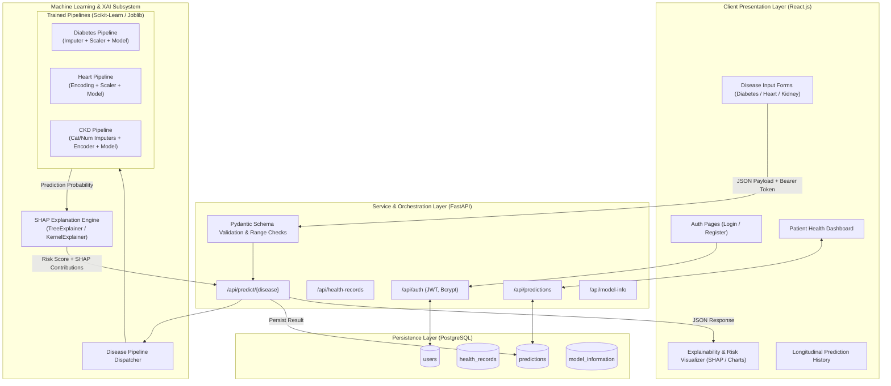
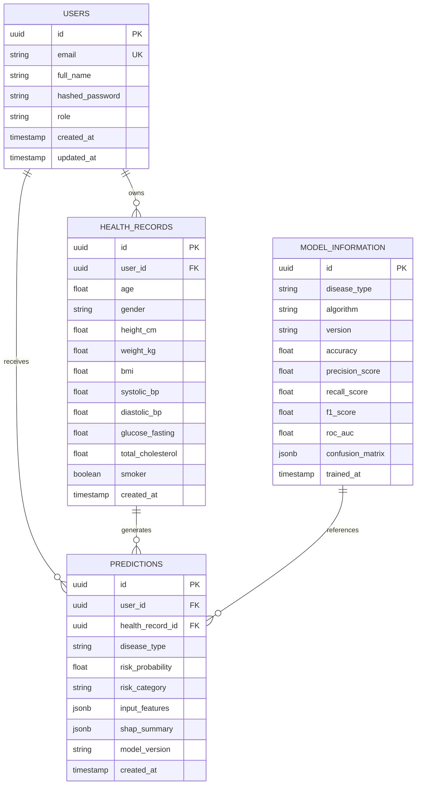

# Implementation Plan: Explainable Machine Learning-Based System for Early Disease Risk Prediction

## 1. Executive Summary & Objective

The objective of this project is to develop an **Explainable Machine Learning-Based System for Early Disease Risk Prediction Using Health Data**. The application provides early multi-disease risk assessment across three primary conditions:
1. **Diabetes Mellitus** (Pima Indians Diabetes Dataset)
2. **Cardiovascular / Heart Disease** (UCI Heart Disease Dataset)
3. **Chronic Kidney Disease (CKD)** (UCI Chronic Kidney Disease Dataset)

Rather than forcing disparate clinical variables into an unnatural single model, the system leverages a **modular multi-pipeline architecture**:
- **Independent ML Pipelines:** Custom cleaning, imputation, scaling, and hyperparameter-tuned classification models for each disease.
- **Explainable AI (XAI):** Local and global model interpretability using **SHAP (SHapley Additive exPlanations)** to elucidate feature contributions for each prediction.
- **FastAPI Common Micro-service Layer:** High-performance REST API handling authentication (JWT), input validation (Pydantic), pipeline routing, and database transactions.
- **PostgreSQL Relational Storage:** ACID-compliant storage for users, longitudinal health records, historical prediction logs, and model metadata.
- **React Modern Web Dashboard:** Responsive, accessible, and intuitive UI with interactive data entry forms, real-time risk gauges, SHAP waterfall/bar charts, and trend analytics.

---

## 2. System Architecture & Component Interaction



---

## 3. Technology Stack & Framework Choices

| Domain | Technology / Library | Version / Tooling | Rationale |
| :--- | :--- | :--- | :--- |
| **Language** | Python | >= 3.10 | Native ecosystem for ML, data science, and high-performance async APIs. |
| **ML Frameworks** | Scikit-learn, XGBoost, NumPy, Pandas | Latest Stable | Standard industry tools for tabular data, cross-validation, and pipeline serialization. |
| **Explainability (XAI)** | SHAP (SHapley Additive exPlanations) | Latest Stable | Game-theoretic feature attribution; provides both direction (+/-) and magnitude for each patient input. |
| **Backend Framework** | FastAPI | >= 0.110 | Asynchronous REST API, automatic OpenAPI/Swagger documentation, strict typing via Pydantic. |
| **Security & Auth** | python-jose, passlib[bcrypt] | Standard | Secure salted password hashing and stateless JWT bearer token authentication. |
| **ORM & Database** | SQLAlchemy + Alembic + PostgreSQL | PostgreSQL >= 14 | Robust relational schema, relational integrity (Foreign Keys), connection pooling. |
| **Frontend Framework** | React.js (Vite) | React 18+ | Fast HMR build tool, declarative component structure, responsive client-side routing. |
| **Visualization UI** | Recharts / Chart.js | Latest | Interactive SVG/Canvas charts for risk distribution, historical trends, and SHAP feature importance. |
| **Testing** | Pytest, Postman, Jest/Vitest | Standard | Unit tests for ML inference pipelines, API integration tests, and UI component tests. |

---

## 4. Directory Structure Blueprint

```
Early-Disease-Prediction/
├── backend/
│   ├── app/
│   │   ├── __init__.py
│   │   ├── main.py                    # FastAPI application initialization & middleware
│   │   ├── config.py                  # Environment variable configuration (Pydantic BaseSettings)
│   │   ├── database.py                # Database engine, session maker, base model
│   │   ├── models.py                  # SQLAlchemy ORM models (User, HealthRecord, Prediction, ModelInfo)
│   │   ├── schemas.py                 # Pydantic request/response schemas
│   │   ├── crud.py                    # Database CRUD operations
│   │   ├── routes/
│   │   │   ├── __init__.py
│   │   │   ├── auth.py                # Registration, login, token refresh
│   │   │   ├── health.py              # Health profile and baseline records
│   │   │   ├── prediction.py          # Disease inference & SHAP routes
│   │   │   └── models_meta.py         # Model registry & performance metrics
│   │   ├── ml/
│   │   │   ├── __init__.py
│   │   │   ├── model_loader.py        # Safe pipeline loading & caching singleton
│   │   │   ├── diabetes_model.py      # Diabetes inference & explanation wrapper
│   │   │   ├── heart_model.py         # Heart disease inference & explanation wrapper
│   │   │   ├── kidney_model.py        # Chronic kidney disease inference wrapper
│   │   │   └── shap_explainer.py      # Common SHAP computation & top-feature formatter
│   │   ├── saved_models/              # Serialized pipeline binaries (.joblib / .pkl)
│   │   │   ├── diabetes_pipeline.joblib
│   │   │   ├── heart_pipeline.joblib
│   │   │   └── kidney_pipeline.joblib
│   │   └── utils/
│   │       ├── auth_utils.py          # Password hashing, JWT token creation/verification
│   │       └── logger.py              # Centralized structured logging
│   ├── tests/
│   │   ├── test_auth.py
│   │   ├── test_predictions.py
│   │   └── test_pipelines.py
│   ├── requirements.txt               # Backend Python dependencies
│   └── Dockerfile                     # Container definition for backend service
│
├── frontend/
│   ├── public/
│   ├── src/
│   │   ├── assets/                    # Icons, illustrations, medical brand logos
│   │   ├── components/                # Reusable UI elements (Navbar, Cards, Gauges, Tooltips)
│   │   │   ├── Navbar.jsx
│   │   │   ├── Footer.jsx
│   │   │   ├── ProtectedRoute.jsx
│   │   │   ├── RiskGauge.jsx          # SVG semi-circle gauge for risk score
│   │   │   ├── ShapWaterfallChart.jsx # Interactive horizontal bar chart for feature impacts
│   │   │   └── MedicalDisclaimer.jsx  # Safety alert & clinical disclaimer modal
│   │   ├── context/
│   │   │   └── AuthContext.jsx        # User session state & token management
│   │   ├── pages/
│   │   │   ├── Home.jsx               # Landing page with project overview & CTA
│   │   │   ├── Login.jsx              # User login
│   │   │   ├── Register.jsx           # User registration
│   │   │   ├── Dashboard.jsx          # Summary overview, quick assessment, recent history
│   │   │   ├── DiabetesPredict.jsx    # Diabetes input form & results display
│   │   │   ├── HeartPredict.jsx       # Heart disease input form & results display
│   │   │   ├── KidneyPredict.jsx      # Chronic kidney disease input form & results display
│   │   │   ├── PredictionHistory.jsx  # Filterable, sortable historical records table
│   │   │   └── ModelInfo.jsx          # Academic transparency page: accuracies, ROC-AUC, datasets
│   │   ├── services/
│   │   │   ├── api.js                 # Axios instance with interceptors for JWT
│   │   │   └── predictionService.js   # Disease inference API callers
│   │   ├── App.jsx                    # Routing configuration
│   │   ├── index.css                  # Modern responsive design system
│   │   └── main.jsx
│   ├── package.json
│   └── vite.config.js
│
├── datasets/
│   ├── raw/
│   │   ├── diabetes/                  # Pima Indians Diabetes raw CSV
│   │   ├── heart/                     # UCI Heart Disease raw CSV
│   │   └── kidney/                    # UCI Chronic Kidney Disease raw CSV
│   └── processed/
│       ├── diabetes_clean.csv
│       ├── heart_clean.csv
│       └── kidney_clean.csv
│
├── notebooks/
│   ├── 01_diabetes_eda_and_modeling.ipynb
│   ├── 02_heart_disease_eda_and_modeling.ipynb
│   ├── 03_chronic_kidney_disease_eda_and_modeling.ipynb
│   └── 04_shap_explainability_analysis.ipynb
│
├── docs/
│   ├── architecture_diagram.png
│   ├── er_diagram.png
│   ├── srs_document.md
│   └── user_guide.md
│
├── .gitignore
├── README.md
└── TODO.md
```

---

## 5. Disease Datasets & ML Pipeline Specifications

### 5.1 Diabetes Mellitus
- **Dataset:** Pima Indians Diabetes Database (National Institute of Diabetes and Digestive and Kidney Diseases).
- **Instances / Features:** 768 rows, 8 clinical features + 1 target (`Outcome`: 0 or 1).
- **Features:**
  - `Pregnancies`: Integer count
  - `Glucose`: 2-hour oral glucose tolerance test plasma concentration (mg/dL)
  - `BloodPressure`: Diastolic blood pressure (mm Hg)
  - `SkinThickness`: Triceps skin fold thickness (mm)
  - `Insulin`: 2-hour serum insulin (mu U/ml)
  - `BMI`: Body Mass Index ($weight\ in\ kg / (height\ in\ m)^2$)
  - `DiabetesPedigreeFunction`: Genetic diabetes pedigree score
  - `Age`: Patient age in years
- **Clinical Data Issues & Preprocessing Strategy:**
  - *Biologically impossible zeroes:* Values of 0 in `Glucose`, `BloodPressure`, `SkinThickness`, `Insulin`, and `BMI` denote missing observations. They must be replaced with `NaN` and imputed using **Median Imputation** (to prevent skew from non-normal distributions).
  - *Scaling:* Standard scaling (`StandardScaler`) fitted strictly on the training partition to avoid data leakage.
  - *Class Imbalance:* Moderate imbalance (~65% negative, 35% positive) handled via stratified split and balanced class weights.

### 5.2 Heart Disease
- **Dataset:** UCI Heart Disease Dataset (Cleveland Database).
- **Instances / Features:** 303 rows, 13 clinical features + 1 target (`target`: 0 = Absence, 1 = Presence).
- **Features:**
  - `age`: Patient age in years
  - `sex`: Gender (1 = male, 0 = female)
  - `cp`: Chest pain type (0: typical angina, 1: atypical angina, 2: non-anginal pain, 3: asymptomatic)
  - `trestbps`: Resting blood pressure (mm Hg on admission)
  - `chol`: Serum cholesterol in mg/dL
  - `fbs`: Fasting blood sugar > 120 mg/dL (1 = true, 0 = false)
  - `restecg`: Resting electrocardiographic results (0, 1, 2)
  - `thalach`: Maximum heart rate achieved during exercise
  - `exang`: Exercise induced angina (1 = yes, 0 = no)
  - `oldpeak`: ST depression induced by exercise relative to rest
  - `slope`: The slope of the peak exercise ST segment (0, 1, 2)
  - `ca`: Number of major vessels (0-3) colored by flourosopy
  - `thal`: Thalassemia status (1 = normal, 2 = fixed defect, 3 = reversible defect)
- **Preprocessing Strategy:**
  - Categorical nominal features (`cp`, `restecg`, `slope`, `thal`) encoded via One-Hot Encoding or Ordinal Encoding.
  - Continuous metrics (`trestbps`, `chol`, `thalach`, `oldpeak`) scaled via `StandardScaler`.

### 5.3 Chronic Kidney Disease (CKD)
- **Dataset:** UCI Chronic Kidney Disease Dataset.
- **Instances / Features:** 400 instances, 24 attributes + 1 class label (`classification`: ckd / notckd).
- **Attributes:**
  - Numerical: `age`, `bp` (blood pressure), `bgr` (blood glucose random), `bu` (blood urea), `sc` (serum creatinine), `sod` (sodium), `pot` (potassium), `hemo` (hemoglobin), `pcv` (packed cell volume), `wc` (white blood cell count), `rc` (red blood cell count).
  - Categorical / Ordinal: `sg` (specific gravity), `al` (albumin), `su` (sugar), `rbc` (red blood cells: normal/abnormal), `pc` (pus cell: normal/abnormal), `pcc` (pus cell clumps: present/notpresent), `ba` (bacteria: present/notpresent), `htn` (hypertension: yes/no), `dm` (diabetes mellitus: yes/no), `cad` (coronary artery disease: yes/no), `appet` (appetite: good/poor), `pe` (pedal edema: yes/no), `ane` (anemia: yes/no).
- **Preprocessing Strategy:**
  - Cleaning erroneous whitespaces and tabs from strings (e.g. `'ckd\t'`, `' yes'`).
  - Imputation: Median for skewed numerical columns; Most Frequent (Mode) for categorical attributes.
  - Target mapping: `ckd` -> 1, `notckd` -> 0.

### 5.4 Candidate Algorithms & Evaluation Criteria
For each condition, 5 candidate classification algorithms are trained and evaluated using **5-Fold Stratified Cross-Validation**:
1. **Logistic Regression** (Linear baseline, highly calibrated probabilities)
2. **Decision Tree Classifier** (Rule-based interpretable baseline)
3. **Random Forest Classifier** (Ensemble bagging, handles non-linearities and tabular outliers)
4. **XGBoost / Gradient Boosting Classifier** (Ensemble boosting, state-of-the-art tabular accuracy)
5. **Support Vector Classifier (SVC)** (Kernel margin maximization)

**Selection Metric Priority:**
In medical risk screening, **Recall (Sensitivity)** and **ROC-AUC** are prioritized over raw accuracy to minimize False Negatives (missing an at-risk patient carries severe clinical implications).

---

## 6. Explainable AI (XAI) Integration Architecture

Prediction outputs without context lead to the "black-box" dilemma in medical informatics. To satisfy academic rigor and user trust:
1. **SHAP (SHapley Additive exPlanations):**
   - Built on cooperative game theory, calculating the marginal contribution of each clinical parameter to the deviation from the base expected value:
   $$f(x) = \phi_0 + \sum_{i=1}^{M} \phi_i(x)$$
   where $\phi_0$ is the base expected value and $\phi_i$ is the Shapley attribution of feature $i$.
2. **Inference Flow:**
   - When a user submits an assessment, the backend executes `pipeline.predict_proba(input_vector)` to compute the risk probability.
   - The fitted `TreeExplainer` or `LinearExplainer` computes local Shapley values $\phi_i$ for the single instance.
   - The top 5 positively contributing factors (increasing risk) and top 3 protective factors (decreasing risk) are extracted, mapped to human-readable clinical names, and returned in the JSON response.
3. **UI Visualization:**
   - Displayed as an intuitive horizontal impact bar chart (green indicating protective values, red indicating elevated risk factors) alongside the overall calibrated risk percentage.

---

## 7. Database Schema & Data Models

PostgreSQL serves as the primary relational database with four core tables:



---

## 8. RESTful API Specification

| Endpoint | Method | Auth Required | Request Body / Params | Response Description |
| :--- | :---: | :---: | :--- | :--- |
| `/api/auth/register` | `POST` | No | `{ email, password, full_name }` | User creation confirmation & basic profile |
| `/api/auth/login` | `POST` | No | `OAuth2PasswordRequestForm` | `{ access_token, token_type: "bearer", user }` |
| `/api/auth/me` | `GET` | Yes | Header: `Bearer <token>` | Authenticated user profile details |
| `/api/health-records` | `POST` | Yes | `{ age, gender, height_cm, weight_kg, ... }` | Persisted health record with auto-computed BMI |
| `/api/health-records` | `GET` | Yes | Query: `limit`, `offset` | List of user's past health records |
| `/api/predict/diabetes` | `POST` | Yes | `{ pregnancies, glucose, blood_pressure, ... }` | `{ risk_score, risk_category, shap_contributions, model_version }` |
| `/api/predict/heart` | `POST` | Yes | `{ age, sex, cp, trestbps, chol, fbs, ... }` | `{ risk_score, risk_category, shap_contributions, model_version }` |
| `/api/predict/kidney` | `POST` | Yes | `{ age, bp, sg, al, su, rbc, pc, ... }` | `{ risk_score, risk_category, shap_contributions, model_version }` |
| `/api/predictions` | `GET` | Yes | Query: `disease_type`, `limit` | Paginated historical risk assessments for user |
| `/api/predictions/{id}` | `GET` | Yes | Path: `id` | Detailed individual prediction with stored SHAP breakdown |
| `/api/models/metrics` | `GET` | No | None | Transparency data: comparison metrics of all deployed models |

---

## 9. Security, Privacy & Compliance Guidelines

1. **Authentication & Password Security:**
   - Zero plaintext password storage; all passwords hashed using **Bcrypt** with dynamic salt (work factor $\ge 12$).
   - JWT tokens signed using HMAC-SHA256 (`HS256`) with ephemeral expiration times (e.g. 60 minutes) and refresh token rotation.
2. **Input Sanitization & Validation:**
   - Strict runtime schema validation via **Pydantic v2**. 
   - Biological bounds validation (e.g., rejecting negative heart rates, impossible glucose levels $> 1000$ mg/dL) preventing injection and inference anomalies.
3. **Clinical / Educational Disclaimer:**
   - The application strictly operates under an **Academic / Risk-Screening Scope**.
   - Mandatory modal disclaimer stating: *"This system is an AI-assisted statistical risk indicator for educational and research purposes. It is not an FDA-cleared or CE-marked diagnostic device. Always consult certified medical practitioners for diagnosis and clinical treatment."*
4. **Data Isolation:**
   - Multi-tenant data isolation: database queries for records and predictions enforce `WHERE user_id = current_user.id`.

---

## 10. Phase-by-Phase Implementation Roadmap

```
Timeline Overview (Total: 4-5 Weeks)
├── Phase 1: Environment, Dataset Acquisition & Exploratory Data Analysis (Days 1 - 4)
├── Phase 2: Pipeline Engineering, Modeling & Model Selection (Days 5 - 10)
├── Phase 3: Explainable AI (SHAP) & Serialization (Days 11 - 14)
├── Phase 4: Backend API & Database Infrastructure (Days 15 - 20)
├── Phase 5: Modern React Frontend & Visualization UI (Days 21 - 27)
├── Phase 6: System Integration, E2E Testing & Security Hardening (Days 28 - 31)
└── Phase 7: Academic Documentation, Presentation & Deployment (Days 32 - 35)
```
